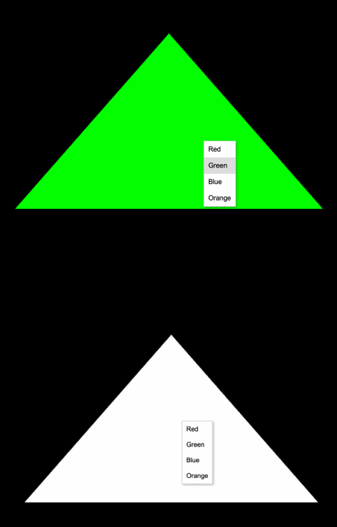

Question :
Write the code that does the menu on the down

Ypu Write OpenGL program that draws a triangle and
allows the user to change its color using a right-click
menu. The menu provides options to select different
colors (Red, Green, Blue, and Orange)

Solution :
[code](main.cpp)
